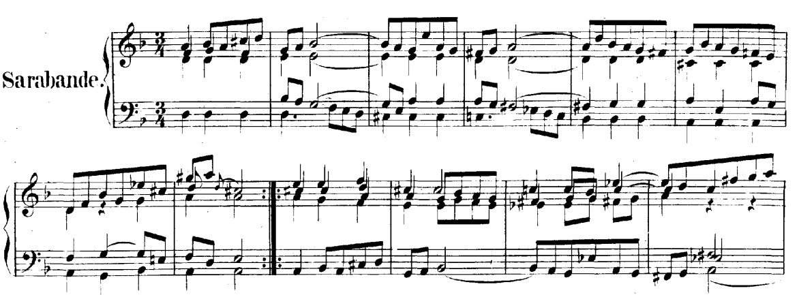

# Definition

Simply put, 

> An appoggiatura is a musical ornament that consists of an added note in a
> melody that is resolved, delaying the appearance of the principle note.  The
> term comes from the Italian verb appoggiare, "to lean upon"... An ascending
> appoggiatura was previously known as a forefall, while a descending
> appoggiatura was known as a backfall.
[@wikiApp]

# Example

# Appoggiatura as an Improvisation Tool

Appoggiatura are improvisatory in nature. Consequently, the performer has great
freedom in their execution. At times, as in Glenn Gould's rendition of the
above suite [@youtube], the performer may replace existing ornamentation with
appoggiaturas or append appoggiatura into the musical text.

# Appoggiatura in J.S. Bachs's Music

J.S. Bach did nothing to indicate the value of the notes of his
appoggiaturas, some have suggested using general rules
set by composers of the period, including C.P.E. Bach,
which state:

> 
> 1. The appoggiatura is played ON THE BEAT.
> 2. The appoggiatura takes half the time of the following note, except when followed by a dotted note. It then usually takes two-thirds of the value of the note.
>
[@bachApp]

# References

